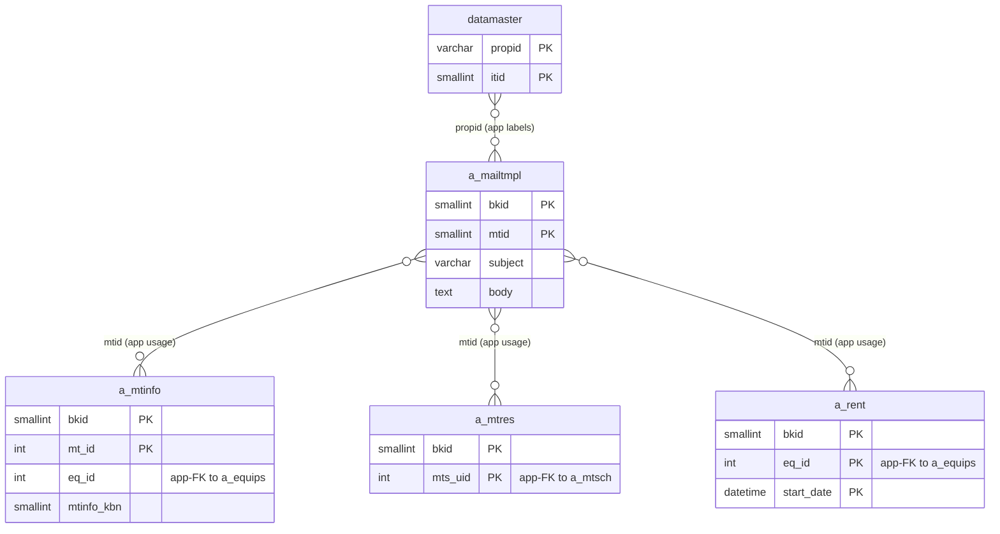
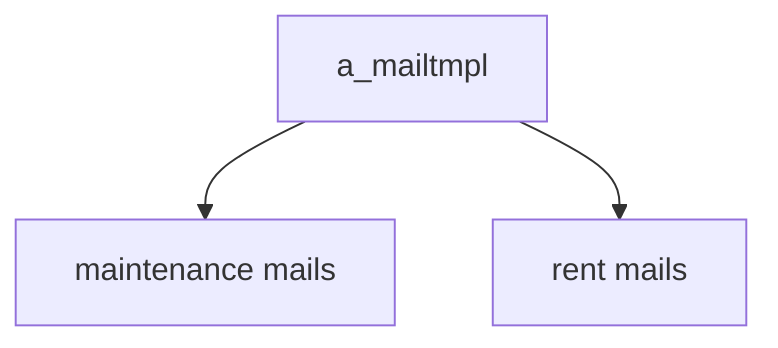

---
aliases:
  - /{tenant}/mailtmpl.php (VI)
tags:
  - ppes
  - vi
  - admin
  - mail
---

# Master mẫu email (VI)

## Thuật ngữ chính

- `メールテンプレート (mẫu email)`
- `置換タグ (thẻ thay thế)`

## Tóm tắt

`/{tenant}/mailtmpl.php` quản lý `a_mailtmpl`.

- controller này không gửi mail trực tiếp
- nhưng thay đổi ở đây ảnh hưởng tới maintenance flow và rent flow

## Bảng chính

- `a_mailtmpl`
- `datamaster`

## Mermaid ER

> **Ghi chú**: Database không có FK constraint. Tất cả quan hệ đều ở tầng application.

Ghi chú suy luận:

- các quan hệ với `a_mtinfo`, `a_mtres`, `a_rent` là quan hệ usage ở tầng application, vì flow mail load template theo `mtid`.

## Mermaid

## Xem thêm

- [[Mail template master]]
- [[Đặt lịch bảo trì (VI)]]
- [[Công việc bảo trì (VI)]]
