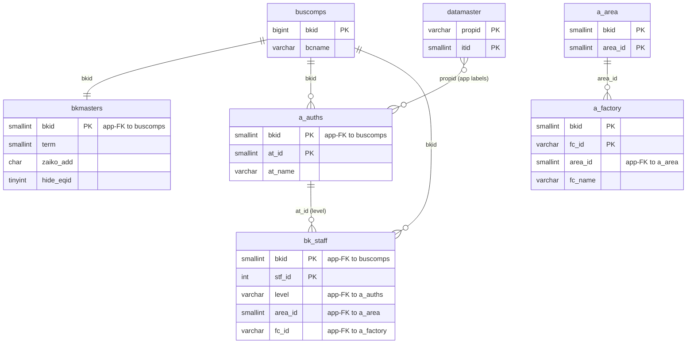
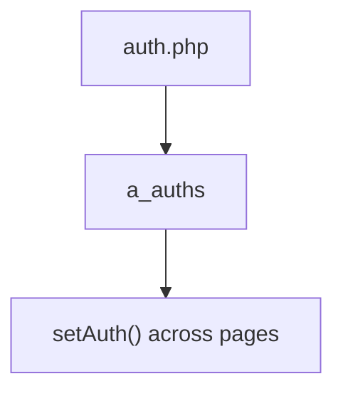

---
aliases:
  - /{tenant}/auth.php (VI)
tags:
  - ppes
  - vi
  - admin
  - auth
---

# Phân quyền master (VI)

## Thuật ngữ chính

- `権限 (phân quyền)`
- `マスタ管理 (quản lý master)`

## Tóm tắt

`/{tenant}/auth.php` quản lý `a_auths`.

- upload/import là nhánh ghi dữ liệu thực sự quan trọng
- list/download đang hoạt động
- manual edit có dấu hiệu stale hoặc copy-paste lỗi

## Bảng chính

- `a_auths`
- `datamaster`
- `a_area`
- `a_factory`
- `buscomps`
- `bk_staff`
- `bkmasters`

## Mermaid ER

> **Ghi chú**: Database không có FK constraint. Tất cả quan hệ đều ở tầng application.

## Mermaid

## Xem thêm

- [[Authorization master]]
- [[Quản lý nhân sự (VI)]]
