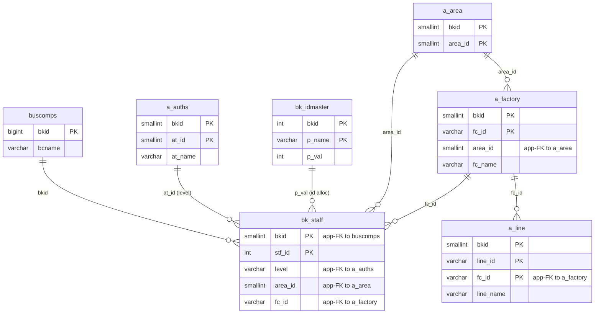
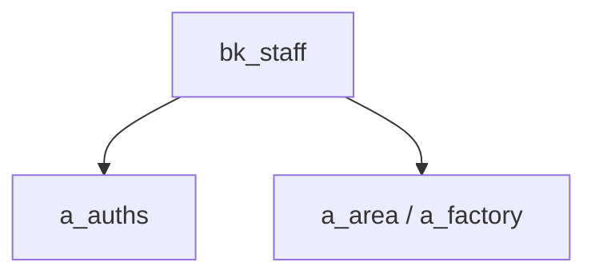

---
aliases:
  - /{tenant}/staff.php (VI)
tags:
  - ppes
  - vi
  - admin
  - staff
---

# Quản lý nhân sự (VI)

## Thuật ngữ chính

- `ユーザ管理 (quản lý người dùng)`
- `担当者 (người phụ trách)`

## Tóm tắt

`/{tenant}/staff.php` quản lý `bk_staff`.

- dùng `a_auths` để gán level quyền
- dùng area/factory để scope người dùng
- hỗ trợ import
- có rule: luôn phải còn ít nhất một admin active

## Bảng chính

- `bk_staff`
- `bk_idmaster`
- `a_auths`
- `a_area`
- `a_factory`
- `a_line`

## Mermaid ER

> **Ghi chú**: Database không có FK constraint. Tất cả quan hệ đều ở tầng application.

## Mermaid

## Xem thêm

- [[Staff management]]
