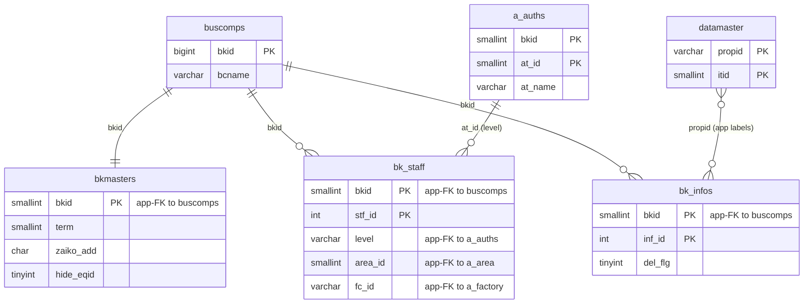
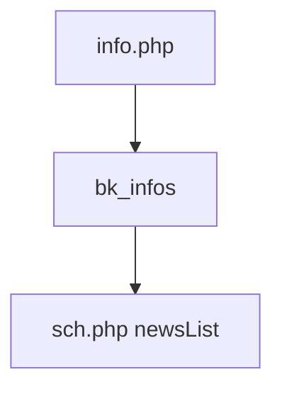

---
aliases:
  - /ppes/info.php (VI)
tags:
  - ppes
  - vietnamese
  - admin
  - info
---

# Thông báo nội bộ (VI)

## Thuật ngữ chính

- `基本情報 (thông tin cơ bản)`
- `お知らせ / 情報 (thông báo / thông tin)`

## Tóm tắt

`/ppes/info.php` là CRUD cho thông báo tenant trong `bk_infos`.

- list / edit / confirm / save / soft-delete
- dữ liệu này được hiển thị lại ở trang lịch như news/info

## Bảng chính

- `bk_infos`
- `datamaster`
- `buscomps`
- `bk_staff`
- `bkmasters`
- `a_auths`

## Mermaid ER

> **Ghi chú**: Database không có FK constraint. Tất cả quan hệ đều ở tầng application.

## Mermaid

## Xem thêm

- [[Info announcements]]
