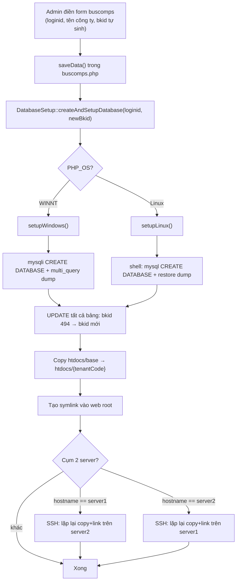
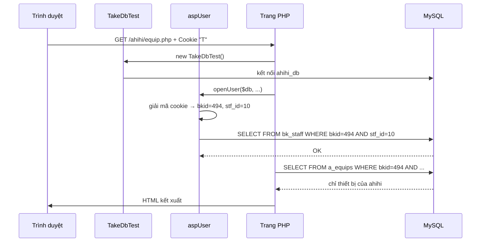

---
aliases:
  - kiến trúc đa tenant
  - đa thuê bao
tags:
  - ppes
  - vi
  - architecture
  - database
  - obsidian
---

# Kiến trúc đa tenant (VI)

Note này mô tả cách hệ thống phân tách dữ liệu và định tuyến request cho nhiều tenant (doanh nghiệp thuê bao).

## Xem thêm

- [[Multi-tenancy architecture]] — bản tiếng Anh đầy đủ
- [[Bản đồ trang PPES (VI)]]
- [[Từ vựng chuyên ngành JA-VI]]

---

## Tổng quan

Hệ thống dùng **chiến lược cách ly kép**:

1. **Mỗi tenant có database riêng** — `{tenantCode}_db` (ví dụ: `ahihi_db`).
2. **Cách ly theo hàng (row-level)** — mỗi bảng đều có cột `bkid`; mọi truy vấn đều lọc theo `bkid`.

Hai lớp này kết hợp với nhau: kết nối DB đã được giới hạn đúng DB của tenant, và query bên trong vẫn lọc thêm theo `bkid`.

---

## Hai loại định danh tenant

| Định danh    | Loại                | Ví dụ   | Nguồn gốc                                    |
| ------------ | ------------------- | ------- | -------------------------------------------- |
| `tenantCode` | Đoạn đầu URL        | `ahihi` | Phân tích `$_SERVER['REQUEST_URI']`          |
| `bkid`       | `SMALLINT` trong DB | `494`   | Lưu trong cookie; tra cứu từ bảng `buscomps` |

`tenantCode` → chọn **database** nào để kết nối.
`bkid` → **khóa hàng** dùng bên trong database đó.

---

## Định tuyến database (`TakeDbTest`)

`lib/TakeDbTest.php` tự động chọn DB của tenant khi khởi tạo:

```
URL                        → Database
/{tenantCode}/trang.php    → {tenantCode}_db
/padmin/trang.php          → zaikodb  (chỉ super-admin)
```

Phương thức phụ `TakeDbTestWithDbName($dbName)` cho phép admin panel kết nối trực tiếp vào DB của bất kỳ tenant nào theo tên. Dùng trong `DatabaseSetup::updateTableAdmin()` khi cấp phát tenant mới.

**Luôn dùng `TakeDbTest`, không khởi tạo `TakeDbMysql` trực tiếp.**

---

## Cookie và luồng `bkid`

`aspUser` đọc và giải mã cookie tên `T` tại mỗi request:

```
Cookie "T" (base64, mã hóa AES):
  {bkid} \002 {stf_id} \002 {mật_khẩu_mã_hóa} \002 {tên_hiển_thị} \002 {cờ_nhân_viên}
```

Sau khi `openUser()` thành công, `$this->_bkid` được gán và truyền vào `$_REQUEST['bkid']`.
Mỗi hàm nghiệp vụ — `$user->Areas()`, `$user->Staffs()`, `$user->Equips()`, v.v. — tự động thêm `WHERE bkid = $this->_bkid` vào truy vấn.

> **Lưu ý:** Module `/padmin/` dùng class `Staff` riêng (không phải `aspUser`). Tài khoản admin panel lưu trong `zaikodb.staff` (không phải `bk_staff`).

---

## Cấu trúc database

### Database riêng của tenant (`{tenantCode}_db`)

Mỗi bảng đều dùng `bkid` làm phần đầu của khóa chính (composite key).

| Nhóm bảng | Bảng |
|---|---|
| Master thiết bị | `a_equips`, `a_equips_detail`, `a_eqhist` |
| Bảo trì | `a_mtinfo`, `a_mtsch`, `a_mtres`, `a_mtbf` |
| Kiểm tra (inspection) | `a_ckgroup`, `a_ckgroup_detail`, `a_ckitem` |
| Master tra cứu | `a_area`, `a_factory`, `a_line`, `a_floor`, `a_eqgroup`, `a_eqgroup_detail`, `a_eqitem`, `a_maker`, `a_eqpoint` |
| Tồn kho | `a_stocks`, `a_eqstocks`, `a_tana` |
| Thuê/mượn | `a_rent` |
| Mail | `a_mailtmpl`, `mail_master` |
| Cấu hình tenant | `bkmasters`, `bk_infos`, `bk_idmaster`, `calendars` |
| Phân quyền / người dùng | `bk_staff`, `a_auths`, `loginhist` |
| Tệp đính kèm | `a_files` |
| Dự án | `p_proj`, `p_purchase`, `p_puritem`, `p_ringi`, `p_rinitem`, `p_sisan`, `p_sisancode`, `p_mente`, `p_item` |
| Khác | `ads_master`, `myview` |

Schema mẫu được lưu trong `docker/base_db.dump` (seed với `bkid = 494`). Khi cấp phát tenant mới, toàn bộ giá trị `494` được thay bằng `bkid` thực của tenant mới.

### Database super-admin (`zaikodb`)

Chỉ dành cho module `/padmin/`.

| Bảng | Mục đích |
|---|---|
| `buscomps` | Danh sách tenant — mỗi hàng là một tenant (`bkid`, `loginid`, tên công ty, trạng thái, feature flags) |
| `staff` | Tài khoản admin panel (tách biệt với `bk_staff` của từng tenant) |
| `tagents` | Danh sách travel agents quản lý từ padmin |
| `infos` | Thông báo hệ thống toàn cục, quản lý qua `padmin/info.php` |
| `datamaster` | Master nhãn đa ngôn ngữ, xem qua `padmin/words.php` |

---

## Cấp phát tenant mới (`padmin/create_db_and_setup.php`)

Kích hoạt từ `padmin/buscomps.php → saveData()` khi tạo tenant mới (`bkid` chưa có).

Class `DatabaseSetup` xử lý tất cả các bước và phân nhánh theo `PHP_OS`:



### Đường dẫn trên production (Linux)

| Tài nguyên | Đường dẫn |
|---|---|
| MySQL config | `/home/www/db_backup/.my.cnf` |
| Base DB dump | `/home/www/db_backup/base_dump/base_db.dump` |
| Source code gốc | `/home/www/tbtech/htdocs/base` |
| Source code tenant mới | `/home/www/tbtech/htdocs/{tenantCode}` |
| Symlink web root | `/var/www/html/{tenantCode}` |

### Cụm 2 server (production AWS EC2)

Tên host: `hozen-tak-honban-1` (IP `10.0.10.98`) và `hozen-tak-honban-2` (IP `10.0.13.232`).
Server nào xử lý request thì SSH sang server còn lại và lặp lại lệnh `cp` + `ln`, dùng key tại `/home/www/.ssh/TBTECH-WEB.pem`.

### Bản ghi sau khi cấp phát

Sau khi tạo DB + filesystem, `buscomps.php → saveData()` còn insert:
- Một hàng vào `buscomps` (registry tenant)
- Một hàng vào `bkmasters` (cấu hình tenant)
- Một hàng vào `bk_idmaster` (seed bộ đếm ID)
- Một hàng vào `bk_staff` với `stf_id=1`, `level=1`, `name="管理者"` (admin đầu tiên của tenant)

`updateTableAdmin()` kết nối vào DB của tenant qua `TakeDbTestWithDbName()` và ghi dữ liệu tương ứng vào DB tenant.

---

## Luồng request từ đầu đến cuối



---

## Lưu trữ tệp

Tệp tải lên được lưu tại `DATA_DIR/{bkid}/`:

```
data/
├── 494/       ← tenant bkid=494
│   ├── equips/
│   ├── mtres/
│   └── ...
└── 500/       ← tenant khác
```

`aspUser->getFilePath()` luôn xây dựng đường dẫn từ `$this->_bkid`, nên tệp không thể bị truy cập chéo giữa các tenant.

---

## Tóm tắt cơ chế cách ly

| Lớp | Cơ chế | Rủi ro nếu sai |
|---|---|---|
| Kết nối DB | `TakeDbTest` định tuyến đến `{tenant}_db` | Kẻ tấn công kiểm soát đoạn đầu URL |
| Lọc theo hàng | Mọi query: `WHERE bkid = $this->_bkid` | Query thiếu điều kiện bkid |
| Xác thực cookie | Mã hóa AES, kiểm tra với `bk_staff` | Cookie bị giả mạo |
| Đường dẫn tệp | `DATA_DIR/{bkid}/...` | Ứng dụng dùng sai bkid |
| Admin panel | DB `zaikodb` riêng, không truy cập được từ URL tenant | Cấu hình web root sai |
