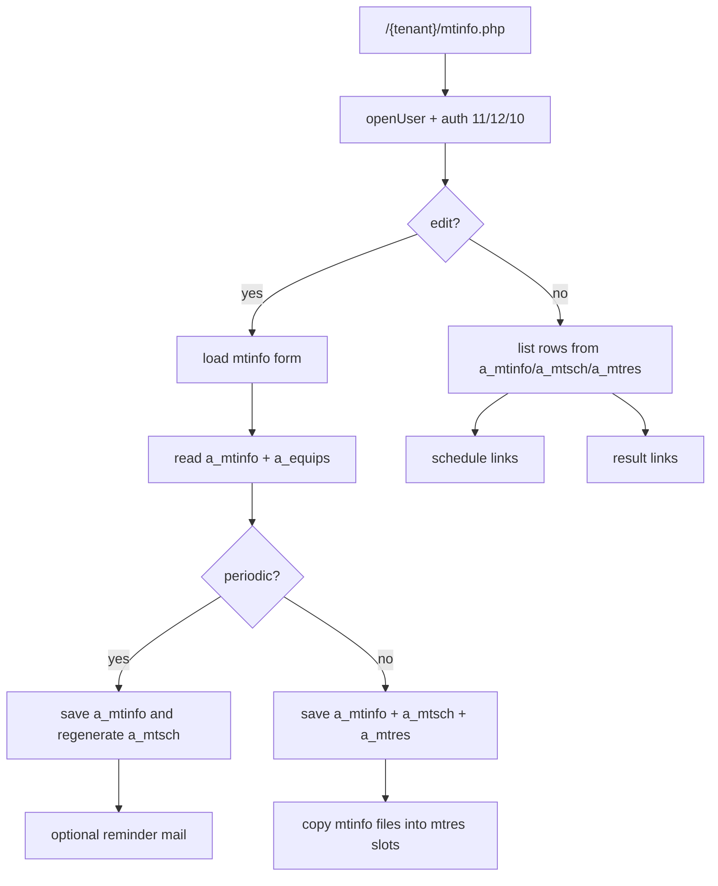
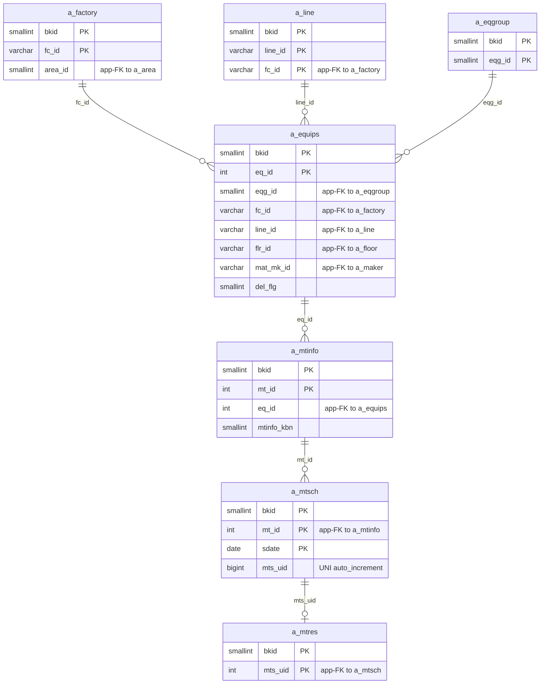

---
aliases:
  - /{tenant}/mtinfo.php
  - /{tenant}/mtinfo.php?
tags:
  - en
  - ppes
  - maintenance
  - work
  - obsidian
---

# Maintenance work page

Related notes:

- [[PPES page map]]
- [[Equipment page]]
- [[Maintenance reservation page]]
- [[Maintenance results list]]
- [[Schedule calendar]]

## Summary

`/{tenant}/mtinfo.php` is the broader maintenance controller used for maintenance definitions, schedule rows, and result-side synchronization.

- In list mode it can show reservation-style or result-style maintenance rows.
- In edit mode it loads one maintenance record and can create or update schedule and result data.
- For periodic work it regenerates schedule rows.
- For non-periodic work it synchronizes one `a_mtsch` row and one `a_mtres` row.

## Core idea

This page sits in the middle of the maintenance pipeline.

- upstream parent: `a_equips`
- owned definition: `a_mtinfo`
- schedule projection: `a_mtsch`
- result projection: `a_mtres`

## Controller flow

| Branch | Trigger | Main reads | Main writes | Side effects |
| --- | --- | --- | --- | --- |
| Upload | `upload=1` | import lookups and `a_equips` | `a_mtinfo`, `a_mtsch` | periodic import |
| Edit/look | `edit=1` | `a_mtinfo`, `a_equips`, optional `a_mtsch`, `a_mtres`, `a_equips_detail` | `a_mtinfo`, `a_mtsch`, `a_mtres` | files, confirm step, reminder mail |
| AJAX delete | `delete=1&mts_uid=...` in list mode | `a_mtsch`, `a_mtinfo` | `a_mtsch`, sometimes `a_mtinfo` | physical delete |
| List/default | no `edit` | joined maintenance/equipment/schedule/result tables | none | CSV download |

## Mermaid: maintenance controller flow

## Mermaid: maintenance table relationships

> **Note**: The database has zero explicit FK constraints. All relationships below are enforced at the application level.

## Tables involved

## List load

- `a_mtinfo`
- `a_equips`
- `a_eqgroup`
- `a_factory`
- `a_line`
- `a_mtsch`
- `a_mtres`
- `datamaster`
- `a_maker`

Auth/session context:

- `buscomps`
- `bk_staff`
- `bkmasters`
- `a_auths`

## Edit load

- `a_mtinfo`
- `a_equips`
- `a_mtsch`
- `a_mtres`
- `a_equips_detail`
- `a_eqgroup_detail`
- `a_eqitem`
- `a_mailtmpl`

## Save path

Always written:

- `a_mtinfo`

One-off path writes:

- `a_mtsch`
- `a_mtres`

Periodic path writes:

- `a_mtsch`

Delete paths remove:

- `a_mtsch`
- sometimes `a_mtinfo`

## Side effects

- periodic save can prune and regenerate future `a_mtsch` rows
- non-periodic save can mirror attachments into mtres storage
- periodic save can send reminder mail from `a_mailtmpl`
- list mode can export CSV
- auth gating can make the page read-only or inaccessible

## Key helper functions

| Function | Role |
| --- | --- |
| `makeList()` | result/reservation list builder |
| `makeEdit()` | form loader for one maintenance record |
| `saveData()` | save/delete orchestration |
| `save_teiki()` | recurring schedule generator |
| `normalize_sub_stfname()` | normalizes assistant staff field |
| `inputCheck()` | validation and time/date rules |
| `uploadTeikiFile()` | periodic import helper |

## Important behavior notes

- The page is both a maintenance definition editor and a schedule/result synchronizer.
- `a_mtres` is not only edited from `mtres.php`; `mtinfo.php` also creates and updates it for one-off work.
- `sch.php` consumes the schedule rows written here.

## Related page flow

- Enter from [[Equipment page]] by choosing maintenance on an equipment record.
- Feed [[Schedule calendar]] through `a_mtsch`.
- Feed [[Maintenance results list]] through completed `a_mtsch` plus `a_mtres`.

## Code references

- `htdocs/base/mtinfo.php:28-52`
- `htdocs/base/mtinfo.php:84-155`
- `htdocs/base/mtinfo.php:203-223`
- `htdocs/base/mtinfo.php:262-601`
- `htdocs/base/mtinfo.php:603-707`
- `htdocs/base/mtinfo.php:807-1134`
- `htdocs/base/mtinfo.php:1307-1426`
