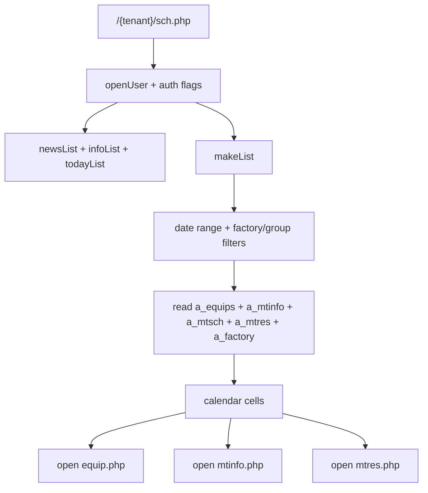
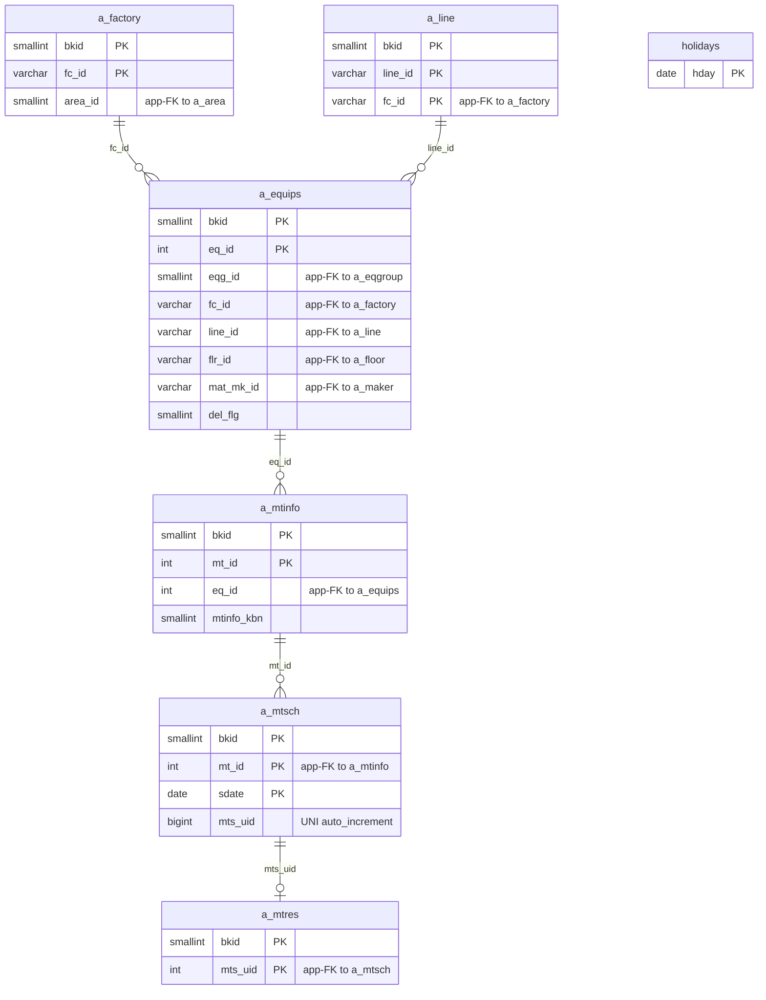

---
aliases:
  - /{tenant}/sch.php
  - schedule page context
tags:
  - en
  - ppes
  - schedule
  - calendar
  - obsidian
---

# Schedule calendar

Related notes:

- [[PPES page map]]
- [[Equipment page]]
- [[Maintenance reservation page]]
- [[Maintenance work page]]
- [[Maintenance results list]]

## Summary

`/{tenant}/sch.php` is a read-heavy calendar and dashboard page over maintenance schedules.

- It does not own the maintenance data.
- It projects schedule rows into day, month, year, and long-range views.
- It also shows today lists, news, and info widgets.
- Its main job is to help users navigate to equipment and maintenance detail pages.

## Controller flow

| Branch | Trigger | Main reads | Main writes | Side effects |
| --- | --- | --- | --- | --- |
| Day view | default `dm` | maintenance schedule joins | none | calendar rendering |
| Month view | `dm=month` | maintenance schedule joins | none | monthly grid |
| Year view | `dm=year` | maintenance schedule joins | none | yearly summary |
| Long view | `dm=long` | maintenance schedule joins | none | multi-year summary |

## Mermaid: schedule projection flow

## Mermaid: schedule table relationships

> **Note**: The database has zero explicit FK constraints. All relationships below are enforced at the application level.

## Tables involved

Main calendar reads:

- `a_equips`
- `a_mtinfo`
- `a_mtsch`
- `a_mtres`
- `a_factory`
- `a_line`
- `holidays`
- `datamaster`

Page widget reads:

- `bk_infos`
- `infos`

Auth/session context:

- `buscomps`
- `bk_staff`
- `bkmasters`
- `a_auths`
- `a_eqgroup`

## Side effects

- no business-table writes in this controller
- redirects to login on failed auth
- applies display-mode auth flags used by the template
- renders a navigation hub into equipment and maintenance detail pages

## Important behavior notes

- This page is a projection, not a source-of-truth editor.
- The rows it shows come from maintenance pages that write `a_mtinfo`, `a_mtsch`, and `a_mtres`.
- If schedule data looks wrong here, the root cause is often upstream in [[Maintenance reservation page]] or [[Maintenance work page]].

## Related page flow

- reads schedule rows generated from [[Maintenance reservation page]] and [[Maintenance work page]]
- links to [[Equipment page]] and maintenance detail pages
- complements [[Maintenance results list]] as the calendar-oriented view of the same data

## Code references

- `htdocs/base/sch.php:19-48`
- `htdocs/base/sch.php:64-165`
- `htdocs/base/sch.php:167-733`
