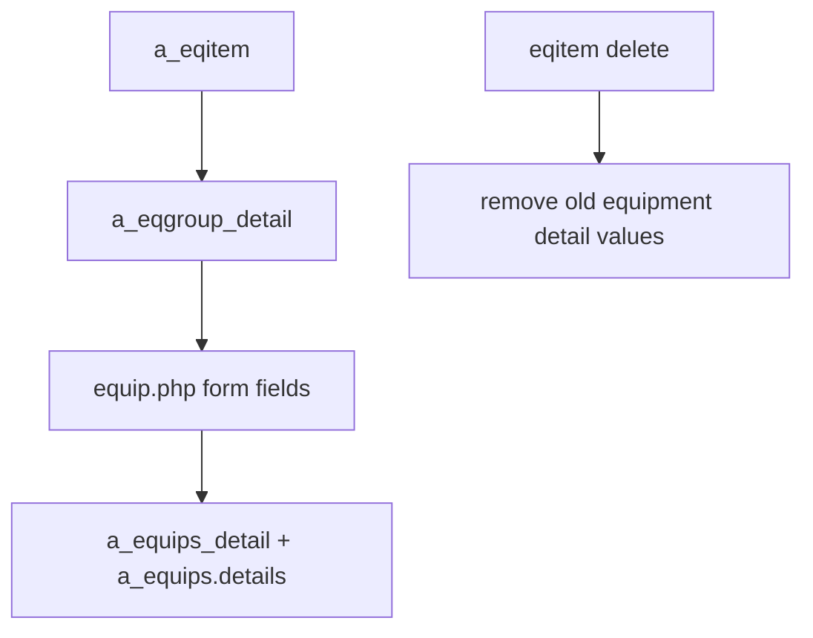
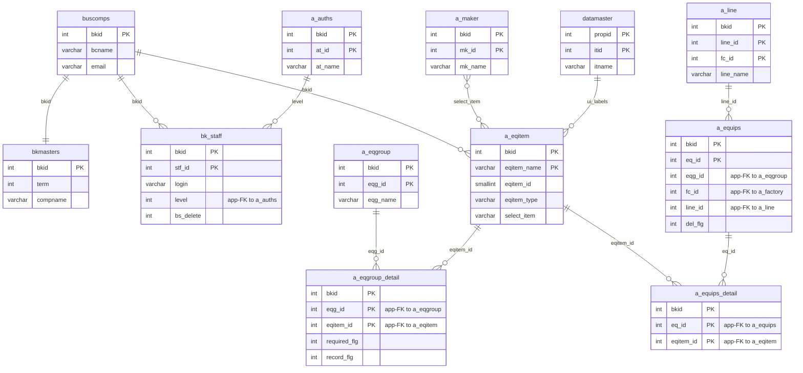

---
aliases:
  - /{tenant}/eqitem.php
tags:
  - en
  - ppes
  - admin
  - eqitem
  - obsidian
---

# Equipment item master

Related notes:

- [[管理 index]]
- [[Equipment group master]]
- [[Equipment page]]

## Summary

`/{tenant}/eqitem.php` manages individual equipment item definitions in `a_eqitem`.

- it lists and edits field definitions
- it can toggle `required_flg` and `record_flg` in `a_eqgroup_detail` via API calls
- deleting an item also cleans dependent equipment detail values

## Mermaid: item usage flow

## Tables involved

- `a_eqitem`
- `a_eqgroup_detail`
- `a_equips_detail`
- `a_equips`
- `a_eqgroup`
- `a_line`
- `a_maker`
- `datamaster`
- `buscomps`
- `bk_staff`
- `bkmasters`
- `a_auths`

## Mermaid: inferred entity relationships

> **Note**: The database has zero explicit FK constraints. All relationships below are enforced at the application level.

Reasoning:

- `a_eqitem` defines fields, `a_eqgroup_detail` decides where they appear, and `a_equips_detail` stores the actual values.
- `a_maker` is not a direct child table, but some item types use maker master values at the application layer.

## Side effects

- API updates for `required_flg` / `record_flg`
- deleting an item cleans equipment detail JSON and detail rows
- no file-system side effects in this controller

## Important behavior notes

- item membership in groups is not primarily managed here; that is mostly driven by [[Equipment group master]]
- equipment forms downstream are built from `a_eqitem + a_eqgroup_detail`

## Code references

- `htdocs/base/eqitem.php:27-47`
- `htdocs/base/eqitem.php:49-95`
- `htdocs/base/eqitem.php:104-176`
- `htdocs/base/eqitem.php:224-365`
