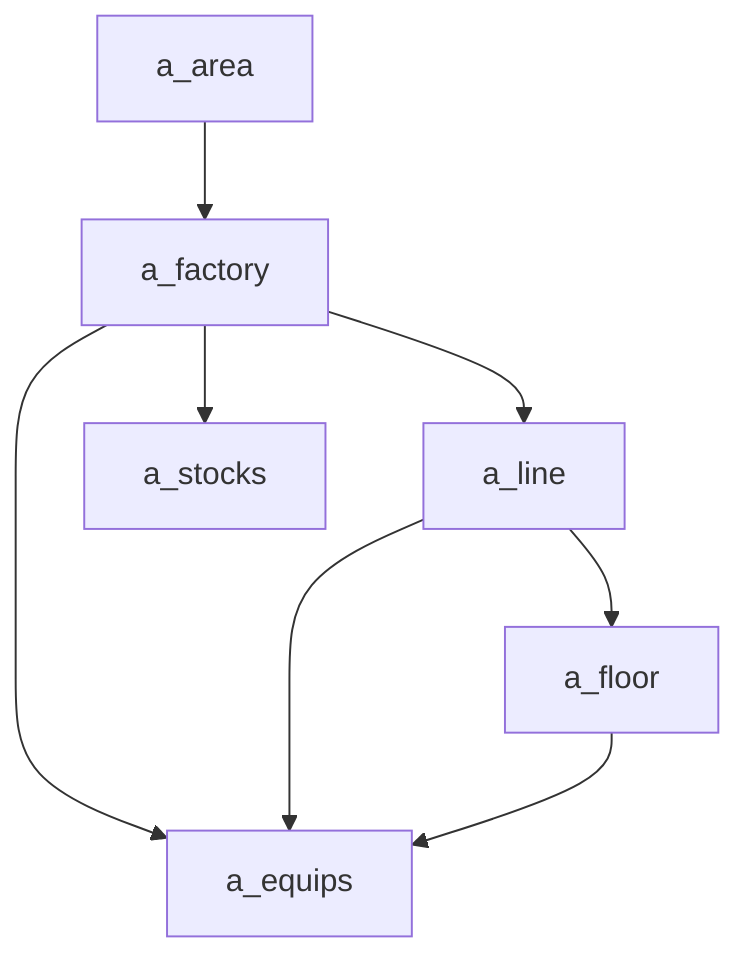
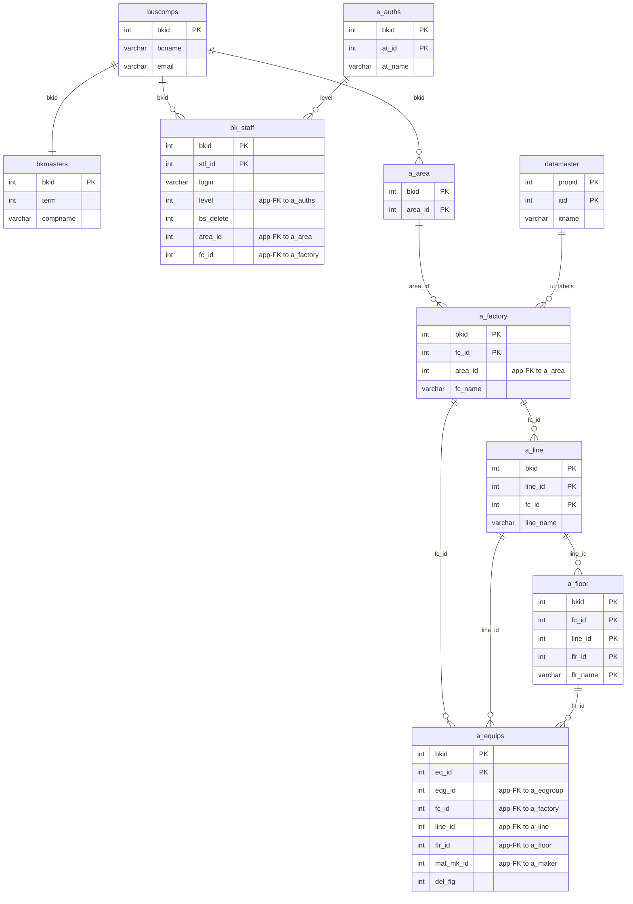

---
aliases:
  - /{tenant}/factory.php
tags:
  - en
  - ppes
  - admin
  - factory
  - obsidian
---

# Factory and location master

Related notes:

- [[管理 index]]
- [[Equipment page]]
- [[Stock management]]

## Summary

`/{tenant}/factory.php` is the source-of-truth controller for the location hierarchy.

- `a_area`
- `a_factory`
- `a_line`
- `a_floor`

It supports list/edit, guarded delete, and bulk upload/export.

## Mermaid: location hierarchy

## Tables involved

- `a_area`
- `a_factory`
- `a_line`
- `a_floor`
- `a_equips`
- `datamaster`
- `buscomps`
- `bk_staff`
- `bkmasters`
- `a_auths`

## Mermaid: inferred entity relationships

> **Note**: The database has zero explicit FK constraints. All relationships below are enforced at the application level.

Reasoning:

- `a_area -> a_factory -> a_line -> a_floor` is the location hierarchy enforced mostly by application logic.
- `a_equips` consumes these masters as placement dimensions even where formal constraints are loose.

## Side effects

- guarded JSON delete endpoints for factory, line, and floor rows
- Excel import/export
- transaction-based bulk upload
- delete is blocked when location rows are referenced by equipment or child rows

## Important behavior notes

- downstream pages like `equip.php` and `stock.php` rely on these masters for selectors and display names
- `Factorys()` only returns factories joined to `a_line`, so incomplete location setup can hide factories from consumers

## Code references

- `htdocs/base/factory.php:28-49`
- `htdocs/base/factory.php:51-177`
- `htdocs/base/factory.php:186-346`
- `htdocs/base/factory.php:429-754`
